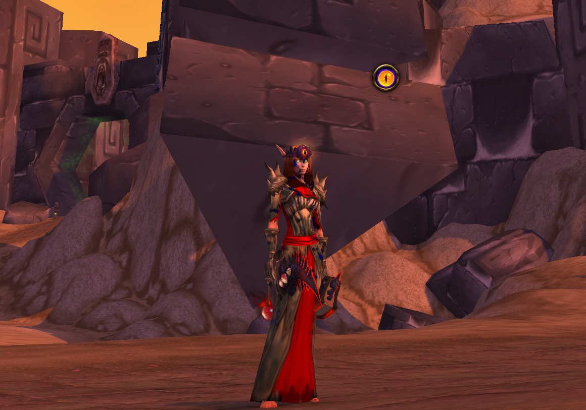

# Old God Whispers World of Warcraft Addon 🦑
Have you ever wanted to hear our lord and saviors maddening whispers on demand? Well now you can. This World of Warcraft addon will display a button on your UI which will allow you to hear whispers from the old gods. You can even enable random mode so you can get the authentic old god experience.

## Getting Started ✈️

This addon can be installed by downloading or forking the repository and placing the `OldGodWhispers` folder within your World of Warcraft `AddOns` folder. The folder structure should look like the following.

```
AddOns
└── DBM-Core
├── OldGodWhispers
│ └── OldGodWhispers.lua
│ ├── OldGodWhispers.toc
```

You can learn how to install WoW addons by following [this guide](https://www.wowhead.com/addons-how-to-install-and-maintain#installing-installing-the-addon).

## Commands 💻

You can view all of the available commands by typing either `/ogw` or `/oldgodwhispers` in the chat. All of the commands in the following table can be run by typing `/ogw <command>` or `/oldgodwhispers <command>`.

| Command        | Description           | Default  |
| ------------- |:-------------:| -----:|
| status      | Shows the current status of the addon, such as which old gods are enabled/disabled.     |  `N/A` |
| `toggle`      | Toggles the button. | `Enabled` |
| `random` | Toggles random whisper mode. Random whispers occur every 5 to 30 minutes.  |  `Disabled` |
| `cthun` | Enables/Disables whispers from C'thun.  |  `Enabled` |
| `ghuun` | Enables/Disables whispers from G'huun.  |  `Enabled` |
| `nzoth` | Enables/Disables whispers from N'Zoth.  |  `Enabled` |
| `ilgynoth` | Enables/Disables whispers from Il'gynoth.  |  `Enabled` |
| `yoggsaron` | Enables/Disables whispers from Yogg-Saron.  |  `Enabled` |


